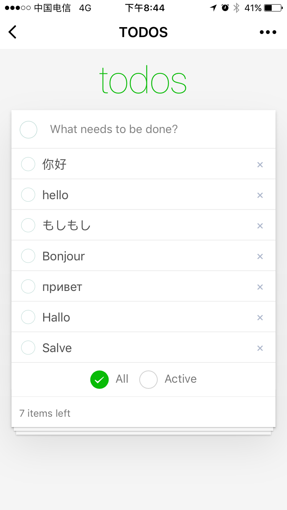

# TODO APP



前端框架基于：[https://github.com/zhuowenli/weapp](https://github.com/zhuowenli/weapp)

## 安装项目依赖

```bash
$ npm install
```

## 使用

### 开发阶段

执行如下命令

```bash
# 启动监视
$ npm run dev
# 选择需要 watch 的模块
# 开始编译并 watch 修改的文件
```

通过微信Web开发者工具打开项目模块根目录下`dist`文件夹，预览

可以通过任意开发工具完成`src`下的编码，`gulp`会监视项目根目录下`src`文件夹，当文件变化自动编译

### 生产阶段

执行如下命令

```bash
# 启动编译
$ npm run build
```

生产阶段的代码会经过压缩处理，最终输出到`dist`下。

同样可以通过微信Web开发者工具测试。

